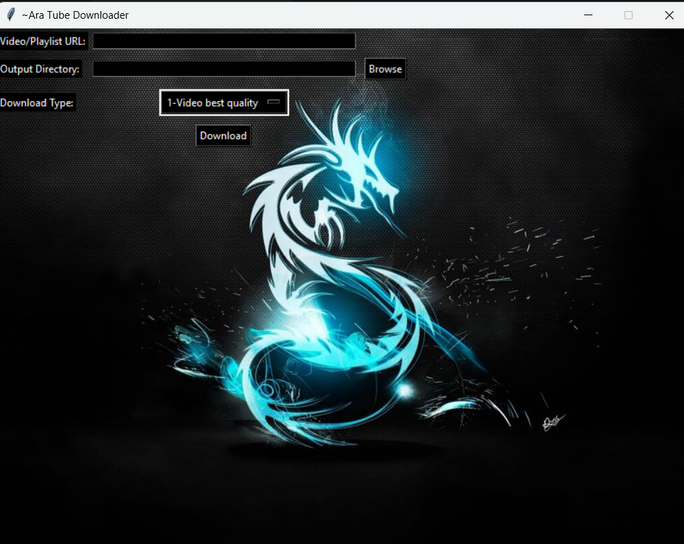
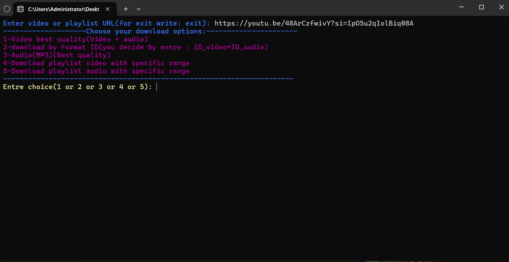

# Aratube Downloader

Aratube Downloader is a tool to download videos and playlists from YouTube with options for different video/audio quality. The project supports both command-line and graphical interfaces, making it user-friendly for all types of users.

## Features

- Download individual videos in best quality 1080p.
- Select video or audio quality by format ID and Check available formats/resolutions before downloading. (e.g., 1080p, 720p, 480p, etc.) .
- Supports downloading video as audio files (e.g., mp3).
- GUI for easy interaction or command-line interface for flexibility.
- Download playlists video from YouTube and choose resolution and playliststart and playlistend.

## Requirements

- Python 3.12+ ,
- `yt-dlp` (YouTube video downloader)
- `termcolor`(for colored CLI text)
- `tk` (for the GUI interface)

## Installation

### Step 1: Clone the Repository

```bash
git clone https://github.com/your-username/aratube_downloader.git
cd aratube_downloader

### Step 2: Create and Activate Virtual Environment
#### Create virtual environment
python -m venv aratube_env

#### Activate virtual environment (Windows)
aratube_env\Scripts\activate
#### if don't work use 
.\aratube_env\Scripts\activate
#### for deactivate env use
.\aratube_env\Scripts\deactivate
#### Activate virtual environment (Linux/Mac)
source aratube_env/bin/activate
#### if you want to work diectly in main python(don't create environment)

#### install requirements in file

pip install -r requirements.txt
## Usage
- You can use the Aratube Downloader via the command-line or the graphical user interface (GUI).

### Command-line Interface (CLI)
-Open a terminal and Run the following command:

```bash
python aratube_cmd.py

- Follow the prompts to enter the video URL and select download options (video, format,audio, etc.).
### Graphical User Interface (GUI)
-Run the following command:
```bash
python aratube_gui.py

-The GUI window will open, allowing you to paste the YouTube link and choose your download preferences.
## Executable Version (Windows)
- If you don't want to run the script through Python, you can use the pre-built .exe version located in releases


## Screenshots

### GUI Interface

*The GUI of Ara tube Downloader.*
### CLI Interface

*The CLI of Ara tube Downloader.*
